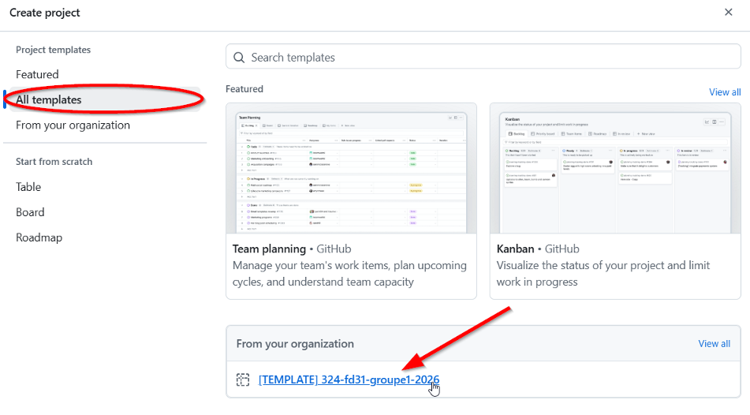

# Exercice — Création d'un repo et d'un projet Github
**Sujet** (module **324**) : Github (repostiory et projet)

**Resources** : Votre compte Github

**Modalité** : En groupe

---
## Objectifs
- Création du repo et du projet Github pour le projet du module 324.

---
## Consigne
Cette activité vous permettra d'utiliser Github pour le dépôt des sources de l'application "petites annonces" que nous avons pris en main dans l'activité précédente. C'est le point de départ de votre projet.

---
## Création du repository
A l'aide du compte d'une personne du groupe :
- Créez un nouveau repository dans l'organisation qui correspond à votre classe (*emf-info-XY*).
- Nommez le repository de la manière suivante : 324-repo-\<classe\>-\<nom groupe\>-\<prenom pef1\>-\<prenom pef2\>. Exemple: 324-repo-fd31-teamFnatic-arnaud-jonas

---
### Configuration du repository
Ajoutez les autres personnes du groupes en tant qu'admin. (Settings -> Collaborators and teams -> Add people)

Activez les paramètres de sécurité pour protéger la branche main :
1) Activer les Branch Protection Rules
Repository → Settings → Branches → Branch protection rules
Créer (ou modifier) une règle sur main
2) Règles à activer (les indispensables)
✅ Require a pull request before merging
    - Interdit le push direct sur main
    - Oblige à passer par une PR
✅ Require approvals
    - Minimum : 1 approbation
✅ Dismiss stale approvals
    - Si l’auteur modifie la PR après une review
        → l’approbation est invalidée

3) La règle clé : empêcher l’auto-merge
✅ Require review from Code Owners (optionnel mais puissant)
    - Si l’auteur n’est pas Code Owner, il ne peut pas s’auto-approuver
✅ Restrict who can dismiss pull request reviews
    - Empêche l’auteur de supprimer une review négative
🚫 Ce que GitHub interdit de base
    - Un auteur ne peut pas approuver sa propre PR
    - Mais il peut la merger si aucune règle ne l’en empêche

---
## Création du projet
Vous pouvez ensuite créer le projet qui contiendra le suivi des issues et des user stories.

Pour cela : sélection de l'onglet "Projects" **dans le repository**.
    
Création d'un nouveau projet sur la base du template :

Attention au nom de projet à l'étape suivante : convention de nommage : 324-proj-\<classe\>-\<nom groupe\>-\<prenom pef1\>-\<prenom pef2\>. 

Exemple: 324-proj-fd31-teamFnatic-arnaud-jonas.

## Conclusion
Votre repository est prêt, vous pouvez dès à présent le cloner sur votre poste de développement. Vous pouvez ensuite créer les stories dans le projet et vous les assigner.